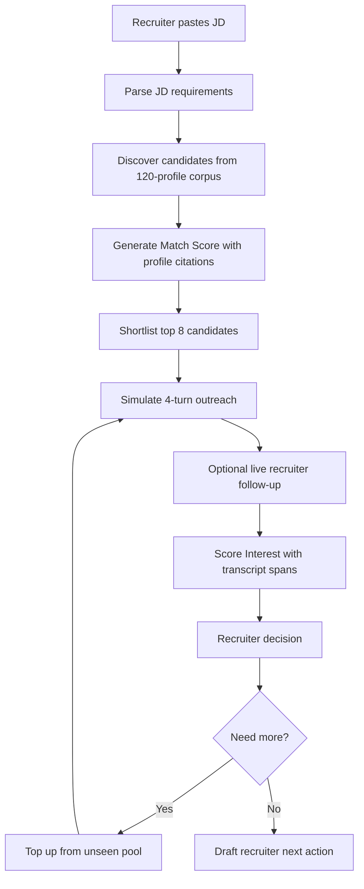

# Plumb — AI Talent Scouting & Engagement Agent

> From JD to recruiter-ready shortlist: discover candidates, explain match, simulate outreach, and rank by genuine interest.

Plumb is a working prototype for the Deccan AI Catalyst problem statement: an AI agent that takes a Job Description, scouts a candidate corpus, explains why candidates match, engages them conversationally, and outputs a ranked shortlist scored on **Match Score** and **Interest Score**.

## See it in action

- **Featured run:** [`/runs/demo`](https://plumb-three.vercel.app/runs/demo) — pre-computed, loads instantly
- **Live app:** [plumb-three.vercel.app](https://plumb-three.vercel.app)

## What the Agent Does

1. **Parses the JD** into structured requirements, nice-to-haves, implicit signals, and red flags.
2. **Discovers candidates** by scanning a seeded 120-profile talent corpus representing ATS, LinkedIn, GitHub, writing, and portfolio-style profile data.
3. **Explains Match Score** with requirement-level citations from each candidate profile.
4. **Simulates outreach** through a 4-turn recruiter/candidate conversation using hidden persona state.
5. **Supports live recruiter follow-ups** in the candidate drill-down: the recruiter can type a new message, the candidate persona replies, and Plumb re-scores the expanded transcript.
6. **Lets recruiters mark decisions** on each candidate and top up the shortlist with unseen candidates when more options are needed.
7. **Scores Interest** with cited transcript spans, then ranks candidates into Recommended, Stretch, Nurture, and Pass cohorts.
8. **Drafts next actions** the recruiter can use immediately.

For the hackathon prototype, candidate discovery runs over `data/pool.json`. In production, the same `CandidateProfile` schema can be populated from ATS exports, LinkedIn/project profiles, GitHub search, referrals, marketplace databases, or CV parsing.

## Why Plumb

| Tool | Matching | Interest modeling |
|---|---|---|
| LinkedIn Recruiter, Gem, hireEZ | Yes (keyword + some embeddings) | Basic (InMail open rates) |
| Metaview, BrightHire | N/A — post-interview | Post-interview sentiment only |
| **Plumb** | Yes, with evidence-cited rubric | **Pre-interview, simulated outreach with structured signal rubric** |

Plumb covers both sides of the assigned problem: **candidate discovery/matching with explainability** and **simulated engagement to assess genuine interest**.

## Candidate Discovery

The prototype searches a committed corpus of 120 structured candidate profiles. Each profile includes:

- Work history and role highlights
- Declared and demonstrated skills
- Education
- Writing samples or open-source signals when available
- Recent public signals
- Hidden persona state used only for simulation, never exposed to the client

Discovery is not a CV parser in this version. It is a sourcing agent over a realistic candidate database. The selected candidates are inserted into Supabase with profile evidence, match score, and status; the UI shows the corpus scanned count, shortlist count, and "Why discovered" evidence.

## The Interest Score Rubric

Five signals, each scored 0–20 and cited to specific conversation turns + spans:

| Signal | What it measures | High | Low |
|---|---|---|---|
| **Specificity of Engagement** | Generic reply vs. substantive questions | Asks about tech stack, team, problems | Pleasantries only |
| **Forward Commitment** | Movement toward next step | "When can we talk?", proposes actions | "Let me think about it" |
| **Objection Handling** | Surface concerns and resolution | Raises concern, engages with answer | No objections (low engagement) |
| **Availability & Timing** | Readiness to move | Active search, short timeline | "Not in a rush" |
| **Motivation Alignment** | Drivers met by opportunity | Role matches their goals | Misaligned drivers |

### Cohort Ranking Policy

| Cohort | Match | Interest | Sorted by |
|---|---|---|---|
| **Recommended** | ≥ 70 | ≥ 60 | Interest ↓ |
| **Stretch** | 50–69 | ≥ 70 | Interest ↓ |
| **Nurture** | ≥ 70 | < 60 | Match ↓ |
| **Pass** | everything else | | Combined ↓ |

## Architecture



**Why client-orchestrated:** Vercel Hobby has a 60s function timeout. The full pipeline can exceed a single request, so the browser orchestrates short idempotent API stages while Supabase stores progress and streams updates.

| Stage | Endpoint | Output |
|---|---|---|
| Create run | `POST /api/runs` | Run row |
| Parse JD | `POST /api/runs/{id}/parse` | Structured JD |
| Discover + match | `POST /api/runs/{id}/rerank` | Top 8 candidates with Match Score and evidence |
| Engage | `POST /api/runs/{id}/candidates/{cid}/simulate` | 8-turn transcript |
| Live follow-up | `POST /api/runs/{id}/candidates/{cid}/chat` | Recruiter turn + candidate persona reply |
| Score interest | `POST /api/runs/{id}/candidates/{cid}/score` | Interest Score and span citations |
| Draft action | `POST /api/runs/{id}/candidates/{cid}/draft` | Interview/nurture/stretch message |
| Decision | `PATCH /api/runs/{id}/candidates/{cid}` | Selected / hold / rejected state |
| Top-up | `POST /api/runs/{id}/top-up` | Additional unique candidates from the unseen pool |

## Model Stack (One Per Task)

| Stage | Model | Why |
|---|---|---|
| JD parsing | Grok 4.2 non-reasoning | Fast structured extraction |
| Candidate discovery | **Kimi K2.6** (256K context) | Full-corpus reasoning, non-obvious matches |
| Simulation — recruiter | Grok 4.2 reasoning | Adaptive questioning across turns |
| Simulation — persona | Grok 4.2 non-reasoning | In-character reaction, low latency |
| Interest scoring | Grok 4.2 reasoning | Structured rubric with span citations |
| Leak/safety checks | Grok 4.2 non-reasoning | Binary classification |
| Next-action drafts | Grok 4.2 non-reasoning | Short-form writing |

**One routing principle:** match each stage to the model whose training profile best matches the task.

## Tech Stack

| Layer | Choice |
|---|---|
| Frontend | Next.js 16 (App Router) + Tailwind CSS 4 |
| Runtime | Vercel Hobby (free, 60s fn limit) |
| Database | Supabase Free (Postgres + Realtime) |
| Abuse protection | Cloudflare Turnstile |
| LLM inference | Azure AI Foundry (Grok 4.2 + Kimi K2.6) |

## Local Setup

```bash
# Clone and install
git clone https://github.com/<user>/plumb && cd plumb
npm install

# Configure
cp .env.example .env.local
# Fill in: Supabase URL/keys, Azure API key, Turnstile keys

# Run migrations on Supabase
# Apply supabase/migrations/*.sql in the Supabase SQL editor

# Verify Azure
node scripts/verify-azure-quick.mjs

# Check Supabase schema
npm run check:supabase
npm run smoke:supabase

# Start dev server
npm run dev
```

## Sample Input and Output

Architecture notes: [`docs/ARCHITECTURE.md`](docs/ARCHITECTURE.md)

Sample input/output: [`docs/SAMPLE_INPUT_OUTPUT.md`](docs/SAMPLE_INPUT_OUTPUT.md)

Featured demo result:

| Candidate | Match | Interest | Cohort | Why it matters |
|---|---:|---:|---|---|
| Maya Chen | 94 | 30 | Nurture | Excellent profile match, low readiness |
| Jules Nakamura | 76 | 91 | Recommended | Slightly weaker match, much stronger intent |

This is the central product behavior: Plumb does not simply rank the best resume. It ranks the recruiter-actionable opportunity.

## Design Decisions

- **Candidate discovery over a seeded corpus** — proves the full scouting workflow without depending on brittle live scraping or PDF parsing during a timed demo.
- **Full-corpus re-rank via Kimi K2.6 instead of embeddings** — 256K context fits the profile corpus. Full reasoning helps surface non-obvious fits.
- **Client-orchestrated pipeline** — free-tier constraint turned into a feature: each stage is idempotent, retryable, and observable.
- **Cohort-based ranking instead of weighted sum** — recruiters think in cohorts, not rankings. "Who should I talk to?" > "Who's #1?"
- **Hidden state + progressive revelation** — personas don't lie; they just don't volunteer. The shape of what's *not* said is itself a signal.
- **Live Outreach Lab** — the prototype uses simulated personas because the assignment asks for simulated engagement. The same API boundary can later route recruiter messages to email, LinkedIn, or an ATS inbox and score real replies.
- **Shortlist top-up** — when a recruiter needs more options, Plumb excludes every candidate already reviewed in the run before ranking the remaining pool. A database uniqueness guard on `(run_id, pool_candidate_id)` prevents duplicate candidates even if a model returns one.
- **Different models for reasoning vs. reaction** — matching model capabilities to task requirements is itself a technical talking point.
- **Static demo fallback** — `/runs/demo` can load a baked Supabase run or a committed public-safe fallback, so the judge flow is not dependent on live model latency.

## Out of Scope

Live LinkedIn/GitHub scraping, user accounts, custom embeddings, historical analytics, A/B testing, rubric editor, and production ATS integrations. CV parsing is a natural ingestion extension, not the core demo path.

## Credits

Built by Ayush Sharma for Catalyst by Deccan AI, April 2026.
Powered by Grok 4.2 and Kimi K2.6 via Azure AI Foundry.
