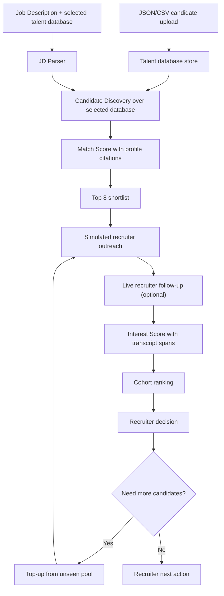

# Plumb Architecture

## Scouting Flow

Plumb treats candidate discovery as a corpus search problem. The hackathon prototype uses `data/pool.json`, a structured 120-profile talent corpus with work history, skills, demonstrated evidence, education, recent signals, writing, and open-source context.

The same `CandidateProfile` schema can now be populated from uploaded JSON/CSV candidate databases. A run stores the selected `talent_database_id`, so matching and top-up use the recruiter-selected database rather than a global corpus.

## Scoring Logic

- **Match Score:** JD requirements are compared against public candidate profile evidence. Each selected candidate stores requirement-level citations, gaps, depth, trajectory, and red flags.
- **Database Selection:** `/api/talent-databases` stores uploaded databases and exposes summaries for the home-page selector. Rerank and top-up load candidates from the selected database, with the seeded corpus as the default.
- **Interest Score:** The agent simulates a 4-turn outreach conversation, then scores five signals: specificity, forward commitment, objection handling, availability/timing, and motivation alignment.
- **Live Outreach Lab:** On a candidate page, the recruiter can send arbitrary follow-up messages to the simulated candidate persona. Each reply is appended to the transcript, the old Interest Score is invalidated, and the candidate is re-scored from the expanded conversation before a fresh next action is generated.
- **Shortlist Top-up:** Recruiter decisions are stored on candidates. When more candidates are needed, `/api/runs/{runId}/top-up` excludes every `pool_candidate_id` already present in that run, ranks only the unseen remainder, inserts the new candidates, then the normal simulate/score/draft stages run for those additions.
- **Ranking:** Candidates are grouped into Recommended, Stretch, Nurture, and Pass cohorts so the recruiter sees the immediate action, not just a flat score.

## Reliability

The live pipeline is client-orchestrated because free-tier serverless requests can time out on a full run. Each stage writes progress to Supabase and can be retried independently. `/runs/demo` also has a committed static fallback in `data/demo-run.json`, so the judge-facing demo route remains available even if model latency or Supabase availability is poor.

Top-ups have two uniqueness layers: application code filters the pool before the model sees it, and migration `004_candidate_review_topup.sql` adds a unique index on `(run_id, pool_candidate_id)` so duplicate shortlist entries cannot be inserted.
